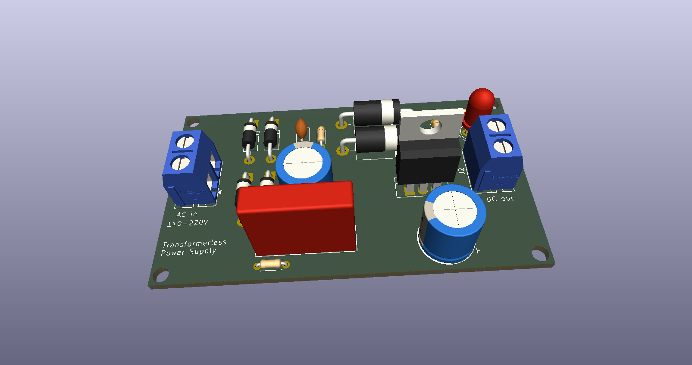

## Images of the PCBs

### AC to DC converter

A simple full bridge diode rectifier with smoothing capacitor and an indicator LED. It takes AC input in one side and outputs DC in the another.

### Transformerless Power Supply

A 70x40 mm PCB that takes 110-220V AC at one side and outputs a stable 5V DC at another terminal. As there is no transformer, the circuit is compact and cheap.
